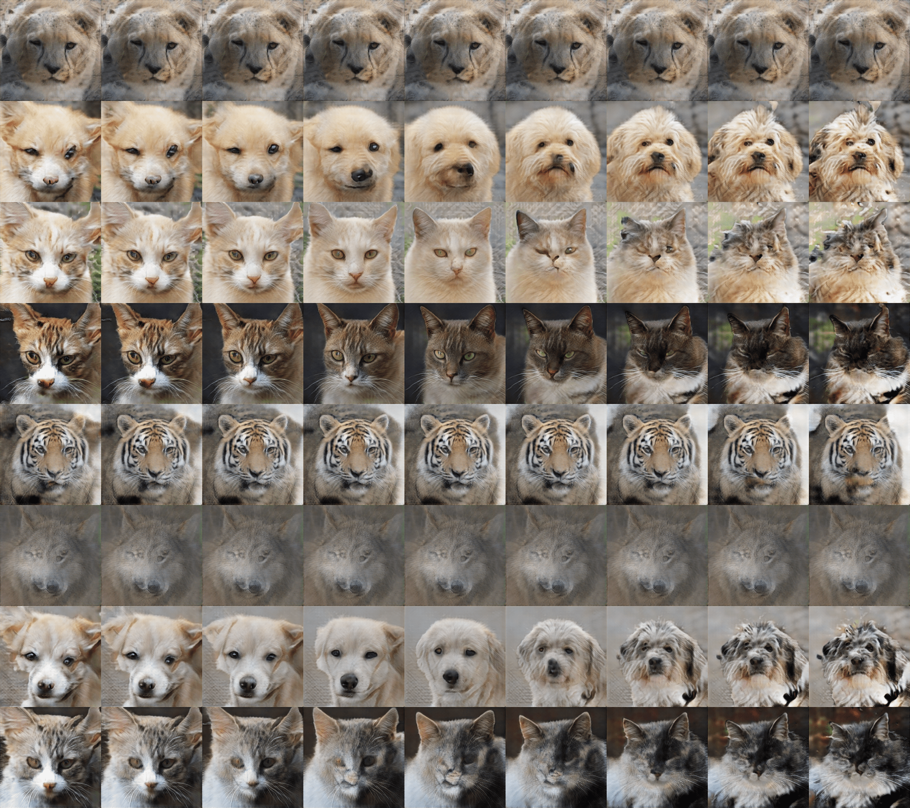
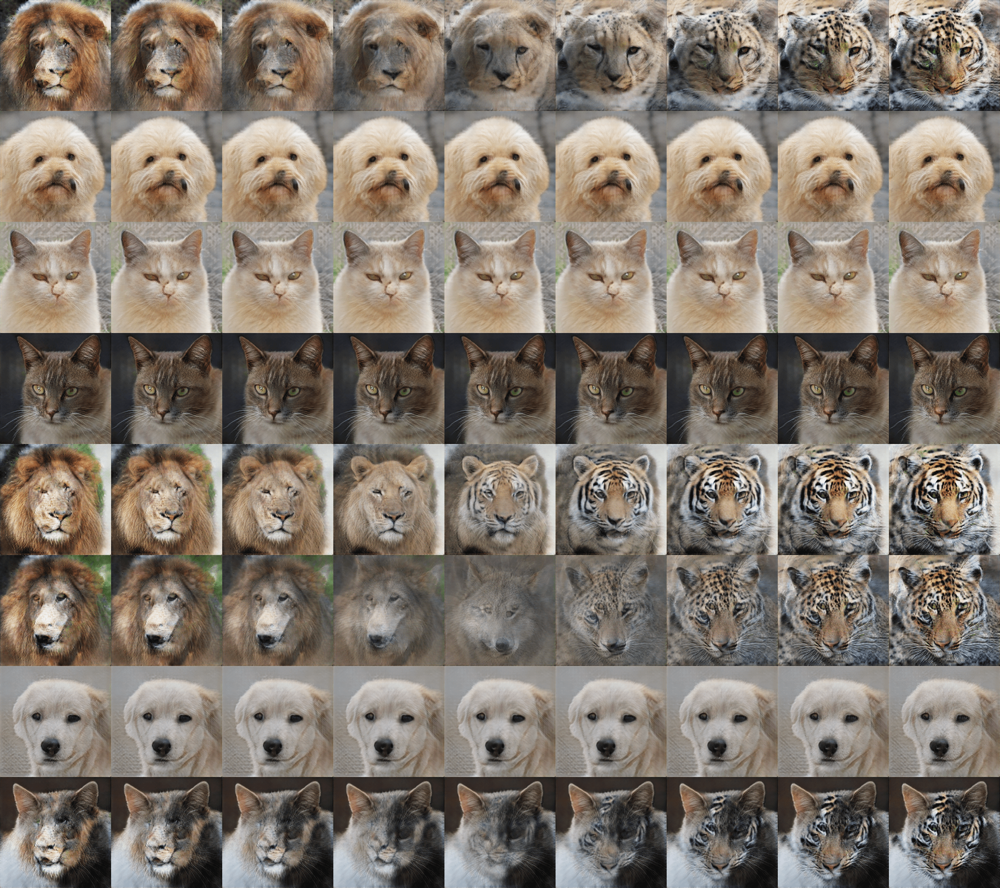
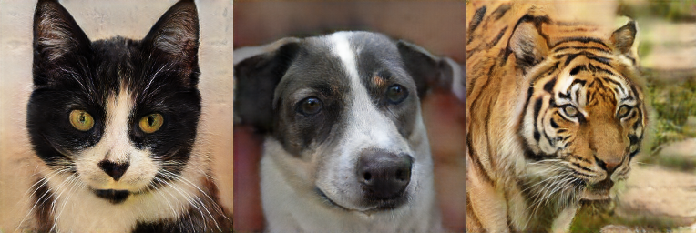

# InfoSCC-GAN-supplement

## Contents
1. [EigenGAN](#eigen_gan)
   
2. [InfoSCC-GAN](#info_scc_gan)  
2.1 [Oneclass global discriminator, Hinge loss, each 2-nd iter classification regularization](#info_scc_gan_global_one_hinge_2)  
2.2 [Oneclass global discriminator, Non saturating loss, each 2-nd iter classification regularization](#info_scc_gan_global_one_non_satur_2)   
2.3 [Multiclass global discriminator, Hinge loss, each 2-nd iteration classification regularization](#info_scc_gan_global_multi_hinge)  
2.4 [Oneclass patch discriminator, Hinge loss, each 2-nd iteration classification regularization](#info_scc_gan_patch_one_hinge)  
2.5 [Oneclass patch discriminator, Non-saturating loss, each 2-nd iteration classification regularization](#info_scc_gan_patch_one_non_saturating)  
2.6 [Oneclass path discriminator, LSGAN loss, each 2-nd iteration classification regularization](#info_scc_gan_patch_one_lsgan)
   
<!-- ################################################################################# 
'Vanilla 'EigenGAN
################################################################################# -->

<h2 align="center">  EigenGAN exploration </h2>
<!--

<h4 align="center">Random samples generated using 'vanilla EigenGAN'</h4>

<h4 align="center">EigenGAN  latent variables exploration. Layer: 0, Dimension: 0 </h4>

<h4 align="center">EigenGAN  latent variables exploration. Layer: 0, Dimension: 1 </h4>

<h4 align="center">EigenGAN  latent variables exploration. Layer: 0, Dimension: 2 </h4>

<h4 align="center">EigenGAN  latent variables exploration. Layer: 0, Dimension: 3 </h4>

<h4 align="center">EigenGAN  latent variables exploration. Layer: 0, Dimension: 4 </h4>

<h4 align="center">EigenGAN  latent variables exploration. Layer: 0, Dimension: 5 </h4>

<h4 align="center">EigenGAN  latent variables exploration. Layer: 1, Dimension: 0 </h4>

<h4 align="center">EigenGAN  latent variables exploration. Layer: 1, Dimension: 1 </h4>

<h4 align="center">EigenGAN  latent variables exploration. Layer: 1, Dimension: 2 </h4>

<h4 align="center">EigenGAN  latent variables exploration. Layer: 1, Dimension: 3 </h4>

<h4 align="center">EigenGAN  latent variables exploration. Layer: 1, Dimension: 4 </h4>

<h4 align="center">EigenGAN  latent variables exploration. Layer: 1, Dimension: 5 </h4>

<h4 align="center">EigenGAN  latent variables exploration. Layer: 2, Dimension: 0 </h4>

<h4 align="center">EigenGAN  latent variables exploration. Layer: 2, Dimension: 1 </h4>

<h4 align="center">EigenGAN  latent variables exploration. Layer: 2, Dimension: 2 </h4>

<h4 align="center">EigenGAN  latent variables exploration. Layer: 2, Dimension: 3 </h4>

<h4 align="center">EigenGAN  latent variables exploration. Layer: 2, Dimension: 4 </h4>

<h4 align="center">EigenGAN  latent variables exploration. Layer: 2, Dimension: 5 </h4>

<h4 align="center">EigenGAN  latent variables exploration. Layer: 3, Dimension: 0 </h4>

<h4 align="center">EigenGAN  latent variables exploration. Layer: 3, Dimension: 1 </h4>

<h4 align="center">EigenGAN  latent variables exploration. Layer: 3, Dimension: 2 </h4>

<h4 align="center">EigenGAN  latent variables exploration. Layer: 3, Dimension: 3 </h4>

<h4 align="center">EigenGAN  latent variables exploration. Layer: 3, Dimension: 4 </h4>

<h4 align="center">EigenGAN  latent variables exploration. Layer: 3, Dimension: 5 </h4>

<h4 align="center">EigenGAN  latent variables exploration. Layer: 4, Dimension: 0 </h4>

<h4 align="center">EigenGAN  latent variables exploration. Layer: 4, Dimension: 1 </h4>

<h4 align="center">EigenGAN  latent variables exploration. Layer: 4, Dimension: 2 </h4>

<h4 align="center">EigenGAN  latent variables exploration. Layer: 4, Dimension: 3 </h4>

<h4 align="center">EigenGAN  latent variables exploration. Layer: 4, Dimension: 4 </h4>

<h4 align="center">EigenGAN  latent variables exploration. Layer: 4, Dimension: 5 </h4>

<h4 align="center">EigenGAN  latent variables exploration. Layer: 5, Dimension: 0 </h4>

<h4 align="center">EigenGAN  latent variables exploration. Layer: 5, Dimension: 1 </h4>

<h4 align="center">EigenGAN  latent variables exploration. Layer: 5, Dimension: 2 </h4>

<h4 align="center">EigenGAN  latent variables exploration. Layer: 5, Dimension: 3 </h4>

<h4 align="center">EigenGAN  latent variables exploration. Layer: 5, Dimension: 4 </h4>

<h4 align="center">EigenGAN  latent variables exploration. Layer: 5, Dimension: 5 </h4>

-->
<!-- #################################################################################
InfoSCC-GAN. Oneclass discriminator, Hinge loss, classification regularization every 2
################################################################################# -->

<h2 align="center">InfoSCC-GAN</h2>

<!-- ##########################################################################################################-->
<h3 align="center">  Oneclass global discriminator, Hinge loss, each 2-nd iter classification regularization</h3>

<h4 align="center">  latent variables exploration </h4>

<h4 align="center"> Explore </h4>

 Each row: fix input label  and latent variables , randomly change 

<h4 align="center"> Explore  and  </h4>

 Each row: fix input label , randomly change latent variables  and  

<h4 align="center"> Explore </h4>

Fix  and , explore all 

<!-- ##########################################################################################################-->
<h3 align="center"> Oneclass global discriminator, Non saturating loss, each 2-nd iter classification regularization</h3>

<h4 align="center">  latent variables exploration </h4>

<h4 align="center"> Explore </h4>

 Each row: fix input label  and latent variables , randomly change 

<h4 align="center"> Explore  and  </h4>

 Each row: fix input label , randomly change latent variables  and  

<h4 align="center"> Explore </h4>

Fix  and , explore all 

<!-- ##########################################################################################################-->
<h3 align="center">Multiclass global discriminator, Hinge loss, each 2-nd iter classification regularization</h3>

<h4 align="center">  latent variables exploration </h4>

<h4 align="center"> Explore </h4>

 Each row: fix input label  and latent variables , randomly change 

<h4 align="center"> Explore  and  </h4>

 Each row: fix input label , randomly change latent variables  and  

<h4 align="center"> Explore </h4>

Fix  and , explore all 

<!-- ##########################################################################################################-->
<h3 align="center">One class patch  discriminator, Hinge loss, each 2-nd iter classification regularization</h3>

<h4 align="center">  latent variables exploration </h4>

<h4 align="center"> Explore </h4>

 Each row: fix input label  and latent variables , randomly change 

<h4 align="center"> Explore  and  </h4>

 Each row: fix input label , randomly change latent variables  and  

<h4 align="center"> Explore </h4>

Fix  and , explore all 

<!-- ##########################################################################################################-->
<h3 align="center">One class patch discriminator, Non-saturating loss, each 2-nd iter classification regularization</h3>

<h4 align="center">  latent variables exploration </h4>

<h4 align="center"> Explore </h4>

 Each row: fix input label  and latent variables , randomly change 

<h4 align="center"> Explore  and  </h4>

 Each row: fix input label , randomly change latent variables  and  

<h4 align="center"> Explore </h4>

Fix  and , explore all 

<!-- ##########################################################################################################-->
<h3 align="center">  One class patch discriminator, LSGAN loss, each 2-nd iter classification regularization</h3>

<h4 align="center">  latent variables exploration </h4>

<h4 align="center"> Explore </h4>

 Each row: fix input label  and latent variables , randomly change 

<h4 align="center"> Explore  and  </h4>

 Each row: fix input label , randomly change latent variables  and  

<h4 align="center"> Explore </h4>

Fix  and , explore all 

